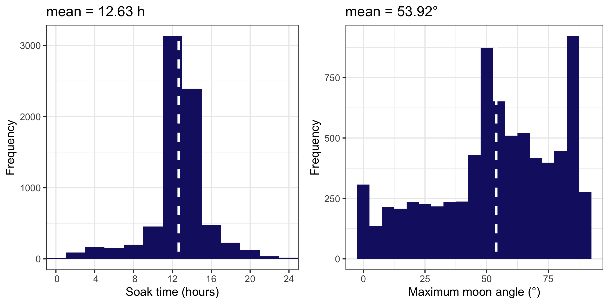

# Moonlight index
### Calculating a fine-scale moon luminosity variable for species occurrence data
<br/>

## 1. Overview

The moon influences the movement patterns of marine animals and, therefore, fishing activity in a variety of ways. It's major effects are upon **tide levels** and **environmental light** during night-time periods. Here we provide a standardized way for fishery researchers to obtain different moon measurements in fine-scale for statistical analysis of catch-and-effort data. 

Fishing sets during exclusively daytime (including **dawn** and **dusk** periods) are automatically identified, and only sets that fished during trully night-time periods (**pre-dawn** or **after-dusk**) for some time are considered for analysis. 

These variables can be then used to calculate the **fine-scale moonlight index** during gear deployment. This approach takes into account the ladscape properties, in which for the moon light to have any expected effect, it's maximum angle in the sky during a fishing set has to enable it to transpass the height of the nearest mountain:


**A.** The maximum angle of the moon is not enough to illuminate the westward part of the island; **B.** The maximum angle of the moon allows it to illuminate the westward part of the island.
<br/>

Not only the moon has to be **high enough** in the sky during a fishing set, but also the amount of **cloud cover** will influence the total moon light that reaches the surface of the water. Therefore, **daily average cloud cover (%)** data is also necessary for calculating the moonlight index. 
<br/><br/>

## 2. Installing required packages and toolkit functions

First download the `Moonlight_index.Rdata` file into your working directory. You are going to need the packages **suncalc** and **lunar** to download the moon variables, and the packages **ggplot2** and **ggarrange** to generate the diagnostic plots. If you don't have these installed you can do so by running:

```
install.packages(suncalc)
install.packages(lunar)
install.packages(ggplot2)
install.packages(ggarrange)
library(suncalc)
library(lunar)
library(ggplot2)
library(ggarrange)
```

Now just you just need to use `load("Moonlight_index.Rdata")` to load the toolkit functions into your global environment and you are all set to go! 
<br/><br/>

## 3. Obtaining moon variables

The `MoonVar()` function can be used for obtaining the following moon variables:

1. Max.moon.time = time of maximum angle of the moon in the sky during fishing gear deployment
2. Angle = maximum angle (°) of the moon in relation to the horizon during fishing gear deployment
3. Illumination = fraction of the moon illuminated by the sun at the time of maximum angle (0 = new moon, 1 = full moon)
4. Phase = the moon phase (0 = new moon, 0.25 = first quarter, 0.5 = full moon, 0.75 = last quarter)
5. Distance = distance (km) from the earth to the moon
6. Parallatic and Azimuth angles (°)
 
The input data to `MoonVar()` is a dataframe (e.g. `df`) in which each row represents one fishing set, and include the locations of gear deployment (**Lon** and **Lat** in decimal degrees), the respective times of set (Time.set) and retrieval (Time.ret) in **UTC**, and the **percentage of cloud coverage** (Cloud):

`head(df)`

|    Lon|     Lat|            Time.set|            Time.ret| Cloud|
|:------|-------:|-------------------:|-------------------:|-----:|
| 55.275| -20.992| 2014-01-14 11:52:00| 2014-01-14 18:10:00|  0.58|
| 55.277| -20.983| 2014-01-14 12:10:00| 2014-01-14 17:55:00|  0.58|
| 55.277| -20.983| 2014-01-14 17:55:00| 2014-01-15 04:05:00|  0.54|
| 55.276| -20.991| 2014-01-14 18:10:00| 2014-01-15 03:50:00|  0.54|
| 55.275| -20.992| 2014-01-15 15:20:00| 2014-01-16 02:53:00|  0.50|
| 55.277| -20.983| 2014-01-15 15:35:00| 2014-01-16 03:05:00|  0.50|
 
You can then simply download the moon variables using `MoonVar()`:

```
> moon.data <- MoonVar(df)
Identifying sets during exclusively daytime periods
  |============================================================| 100%
M: A total of 2191 sets were deployed exclusively during day light and will be removed.
M: A total of 88 sets encompass multiple nights and will be also removed.
Identifying moments of true night-time
  |============================================================| 100%
Identifying times of maximum moon angle during fishing sets
  |============================================================| 100%
Downloading moon variables
  |============================================================| 100%
```

Please note that in this example a total of **2191** sets fished exclusively during **daytime** and were automatically identified and excluded from  analysis. Another **88** sets were either **deployed before dawn at retrieved after dusk on the same day** or had deployment times **longer than 24-h** (i.e. encompassing multiple nights), and were also excluded.

The output of this function is a list containing the three following objects:

1. The processed dataset including the corresponding moon variables:

`head(moon.data$data)`

|      Max.moon.time|  Angle| Illumination|  Phase| Distance| Parallatic|  Azimuth|
|:------------------|------:|------------:|------:|--------:|----------:|--------:|
|2014-01-14 18:10:00| 46.734|    0.9808496| 0.4558| 404942.7|  -155.1768|-154.7677|
|2014-01-14 17:55:00| 45.168|    0.9805959| 0.4555| 404927.8|  -150.8519|-150.3628|
|2014-01-14 19:25:00| 50.543|    0.9820907| 0.4572| 405015.8|   179.7001| 179.6954|
|2014-01-14 19:10:00| 50.378|    0.9818462| 0.4569| 405001.4|  -174.9776|-174.8984|
|2014-01-15 20:20:00| 52.231|    0.9971338| 0.4829| 405873.1|   176.4489| 176.3572|
|2014-01-15 20:05:00| 52.266|    0.9970746| 0.4827| 405870.2|  -178.0112|-177.9603|


2. An integer vector identifying which sets (row numbers) from the input dataset fished exclusively during daytime periods:

```
> length(moon.data$bad_set.index)
[1] 2279
> head(moon.data$bad_set.index)
[1]  5  6  7  8 11 12
```

3. Diagnostic histograms of soak time and maximum moon angle distributions:

```
moon.data$plot.diag
```




## 4. Calculating the fine-scale moonlight index

Before we can calculate the moonlight indexes, we first need to obtain the angle (alpha) that the moon has to overcome in relation to the horizon so that it can influence the study area (e.g. so that the moon becomes higher in the sky than the nearest mountain). Detailed descriptions of the method can be found in Niella et al. 2020 (REF), but briefly this angle can be obtained according to the following equation:


In which **altitude** is the height of the nearest point and **Y** is its straight-line distance to the study area. 

After calculating this constant angle (alpha), the moonlight index can be calculated using the function `MoonIndex()` by simply providing the output from `MoonVar()` and alpha, which automatically uses the following equation:


In which **x** represents the moon illumination at the time of maximum angle, **beta** is the maximum angle of the moon in the sky during gear deployment, and **z** is the percentage of daily cloud cover. For those sets in which beta was lower than alpha (i.e. maximum angle in the sky not able to overcome the highest mountain), the moonlight index will be automatically set to zero.

```
df.moon.index <- MoonIndex(data = df.moon, angle = 8.31) # Using a 8.31° angle!
```

The output of the function similar to the input dataset (df.moon), but includes the **MoonIndex** column containing the calculated data:

|      Max.moon.time|  Angle| Illumination|  Phase| Distance| Parallatic|  Azimuth|  MoonIndex|
|:------------------|------:|------------:|------:|--------:|----------:|--------:|----------:|
|2014-01-14 18:10:00| 46.734|    0.9808496| 0.4558| 404942.7|  -155.1768|-154.7677|  0.2975992|
|2014-01-14 17:55:00| 45.168|    0.9805959| 0.4555| 404927.8|  -150.8519|-150.3628|  0.3187362|
|2014-01-14 19:25:00| 50.543|    0.9820907| 0.4572| 405015.8|   179.7001| 179.6954|  0.3475461|
|2014-01-14 19:10:00| 50.378|    0.9818462| 0.4569| 405001.4|  -174.9776|-174.8984|  0.3151233|
|2014-01-15 20:20:00| 52.231|    0.9971338| 0.4829| 405873.1|   176.4489| 176.3572|  0.3941124|
|2014-01-15 20:05:00| 52.266|    0.9970746| 0.4827| 405870.2|  -178.0112|-177.9603|  0.3942758|


